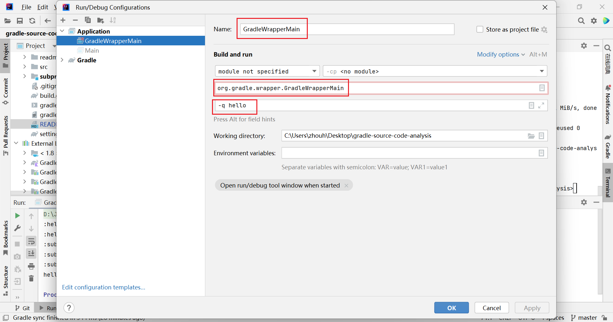
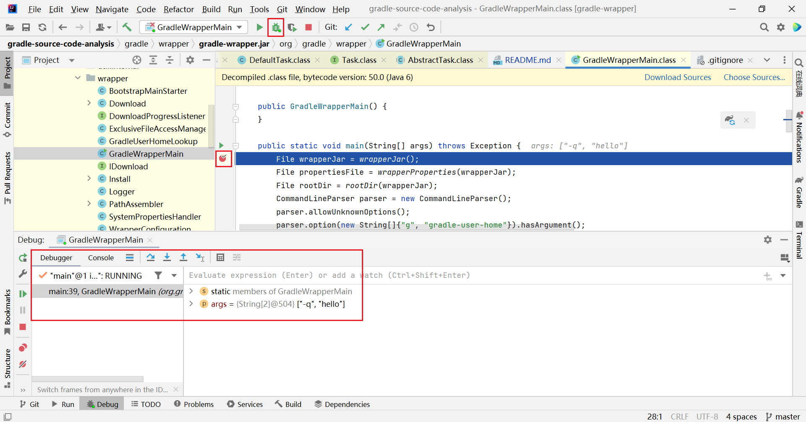
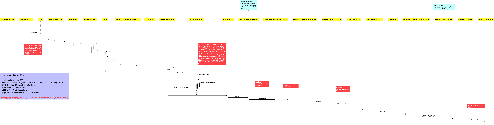
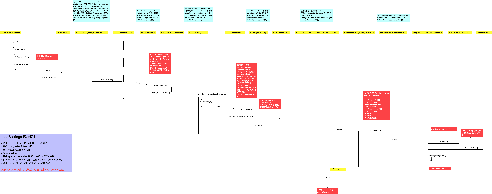

# Gradle 源码分析

## gradlew.bat分析

gradlew.bat 大部分是环境设置、参数处理、代码注释等内容

最重要的一行 

`"%JAVA_EXE%" %DEFAULT_JVM_OPTS% %JAVA_OPTS% %GRADLE_OPTS% "-Dorg.gradle.appname=%APP_BASE_NAME%" -classpath "%CLASSPATH%" org.gradle.wrapper.GradleWrapperMain %*`

`set CLASSPATH=%APP_HOME%\gradle\wrapper\gradle-wrapper.jar`

其实就是执行了 gradle\wrapper\gradle-wrapper.jar 里面的 org.gradle.wrapper.GradleWrapperMain 的 main() 方法

## GradleWrapperMain分析

源码在`gradle-7.6.0/subprojects/wrapper/src/main/java/org/gradle/wrapper/GradleWrapperMain.java`

## 项目

1. 项目的路径

根项目直接显示项目名

root project 'gradle-source-code-analysis'

子项目

:subproject01 表示根项目下的subproject01项目

## 任务

1. 任务的命名

使用小驼峰命名法

2. 子项目的任务执行

gradlew -q hello

3. 任务重名

gradlew -q helloTask 

4. 路径规则

:helloTask 表示根项目下的任务 helloTask

:subproject01:helloTask 表示是子项目01下的helloTask

会执行所有项目所有名字为helloTask的任务

5. 通过任务路径来找任务，可使用任务名 任务相对路径 任务绝对路径

任务名 helloTask，表示在当前项目找，只写任务名，其实是任务的相对路径

任务相对路径 subproject01:helloTask 

任务绝对路径 :subproject01:helloTask

6. 任务的运行

+ gradlew helloTask  运行所有项目的helloTask
+ gradlew :helloTask 运行根项目的helloTask
+ gradlew subproject01:helloTask 运行根项目下子项目subproject01的helloTask
+ gradlew :subproject01:helloTask 运行根项目下子项目subproject01的helloTask

## 命令行参数

-q, --quiet                        Log errors only.

## gradle-wrapper.jar

1. 右键 Add as library 可以看jar包里面的代码

2. 添加 直接运行 GradleWrapperMain的运行配置

*备注：忽略IDEA提示的配置错误*

3. 添加好运行配置后，可进行debug

## 源码分析图

*来自网络*